# Baffleword - A Boggle Word Game Parody

[](https://github.com/RandyNorthrup/baffleword/actions/workflows/ci.yml)
[](https://github.com/RandyNorthrup/baffleword/releases)
[](LICENSE)


Baffleword is a single-player, **parody clone of the classic Boggle® dice word game** — an independent, unofficial homage built for fun and learning. You shake up a grid of letter dice and race the clock to trace as many words as you can across adjacent tiles. It's a polished cross-platform desktop game built with .NET 10 and Avalonia, featuring three game modes, MVVM architecture, drag-to-select, achievements, and persistent high scores.

> **Not affiliated with, endorsed by, or sponsored by Hasbro.** Boggle® is a registered trademark of Hasbro, Inc. Baffleword is a fan-made parody and is neither produced nor approved by the trademark owner. See [Disclaimer](#disclaimer).

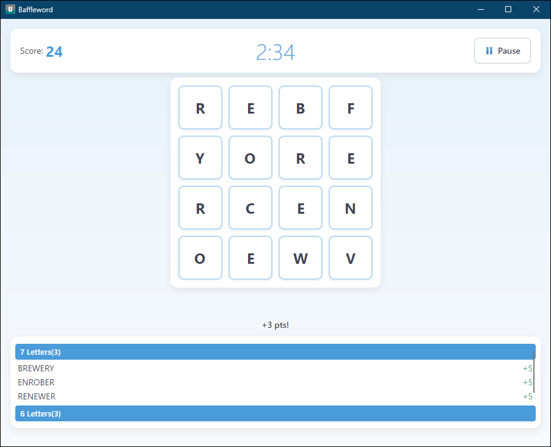

## See it play

| Trace a word | Finish the round |
|---|---|
| 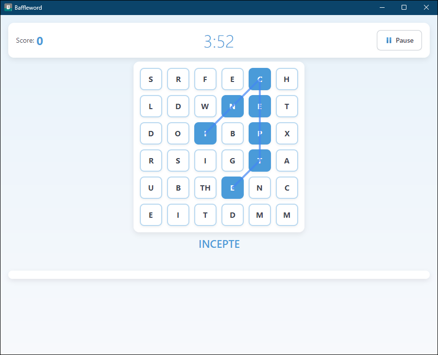 | 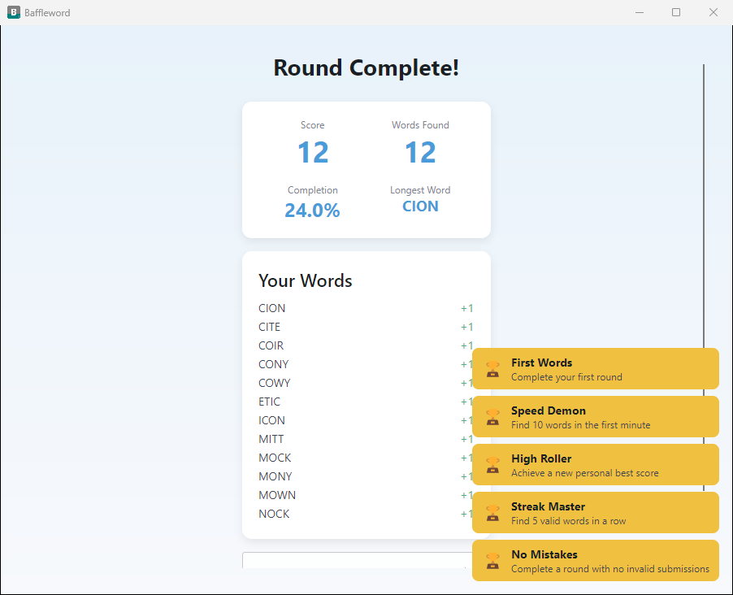 |
| Click and drag across adjacent tiles — the path is drawn as you go and the word builds live beneath the board | Every round ends with a full breakdown: score, words found, board completion, longest word, and any achievements you just unlocked |

## Features

- **Three game modes** - Standard (4x4), Big Board (5x5), and Super Board (6x6 with blocked tiles and digraph dice)
- **Drag-to-select** - Click and drag across adjacent tiles to form words
- **NWL2020 dictionary** - 191,745 words from the official North American Scrabble tournament word list, with Trie-based prefix and full-word lookups
- **Board solver** - Finds all possible words on any board via DFS traversal
- **High scores** - Persistent SQLite leaderboard with top 50 scores per game mode
- **26 achievements** - Unlock milestones across all three game modes
- **Audio system** - Cross-platform SoundFlow backend for sound effects and background music
- **Pause/resume** - Pause mid-round without losing progress
- **Settings** - Adjustable SFX and music volume with mute toggle

## Game Modes

| Mode | Grid | Min Word Length | Timer | Notes |
|------|------|----------------|-------|-------|
| Standard | 4x4 | 3 letters | 3 min | Classic letter-grid play |
| Big Board | 5x5 | 4 letters | 3 min | Larger grid, longer words |
| Super Board | 6x6 | 4 letters | 4 min | Blocked tiles, digraph dice |

| Big Board (5x5) | Super Board (6x6) |
|---|---|
| 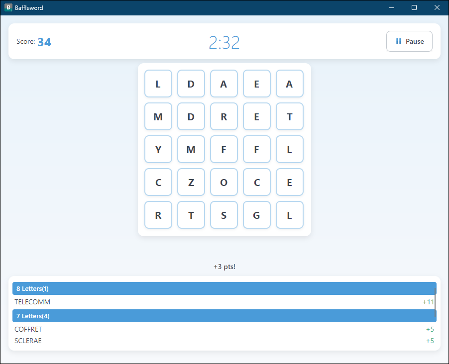 | 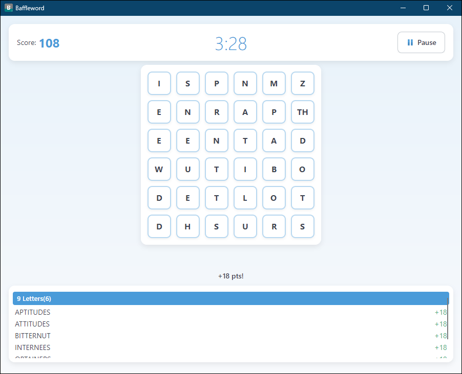 |
| Twenty-five dice and a four-letter minimum push you toward longer words | Thirty-six dice, digraph tiles like `TH`, and 2-points-per-letter scoring on 9+ letter words |

## Screens

| Main menu | How to play |
|---|---|
| 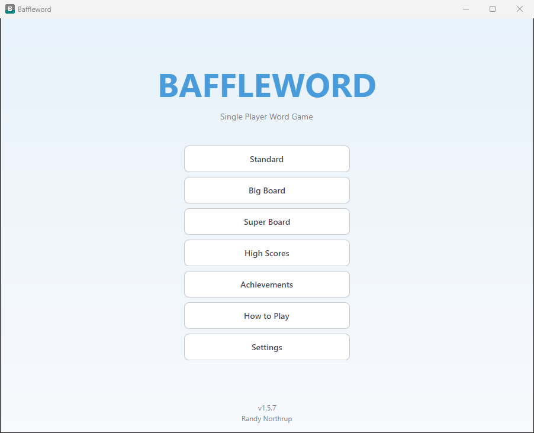 | 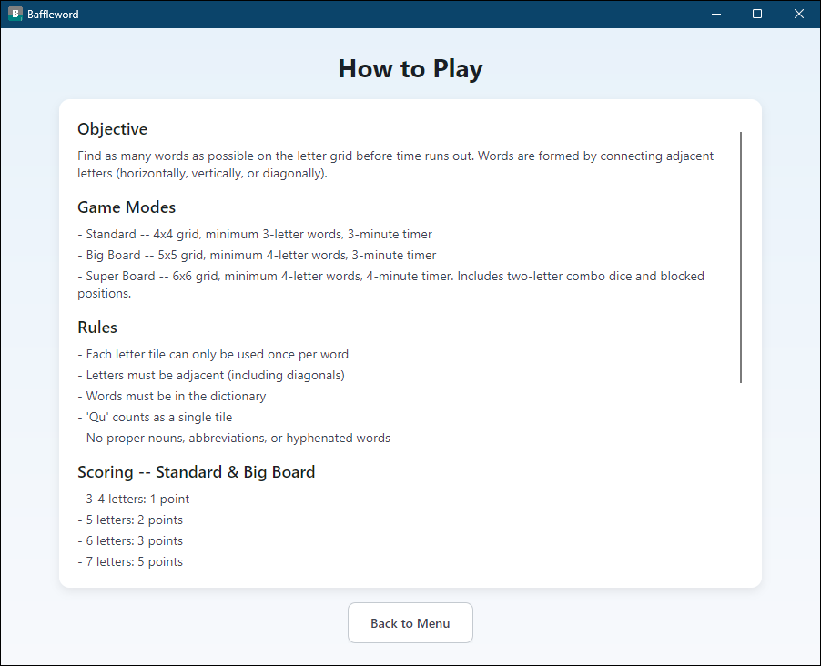 |

| Pause | Settings |
|---|---|
| 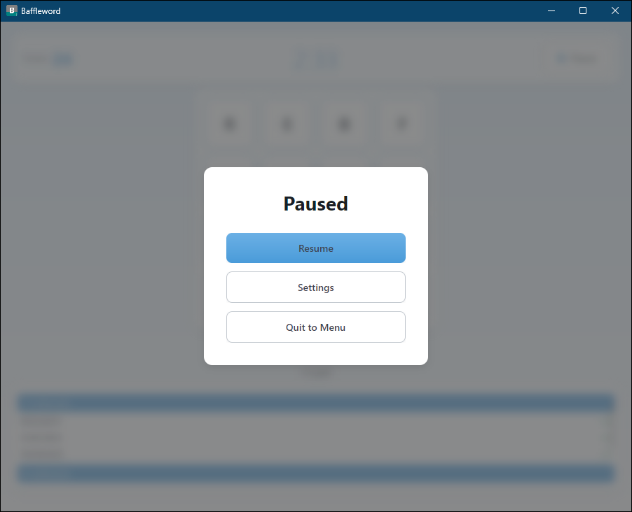 | 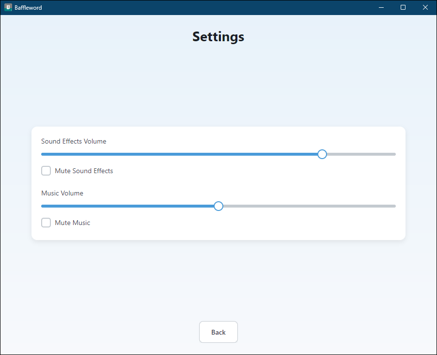 |

| High scores | Achievements |
|---|---|
| 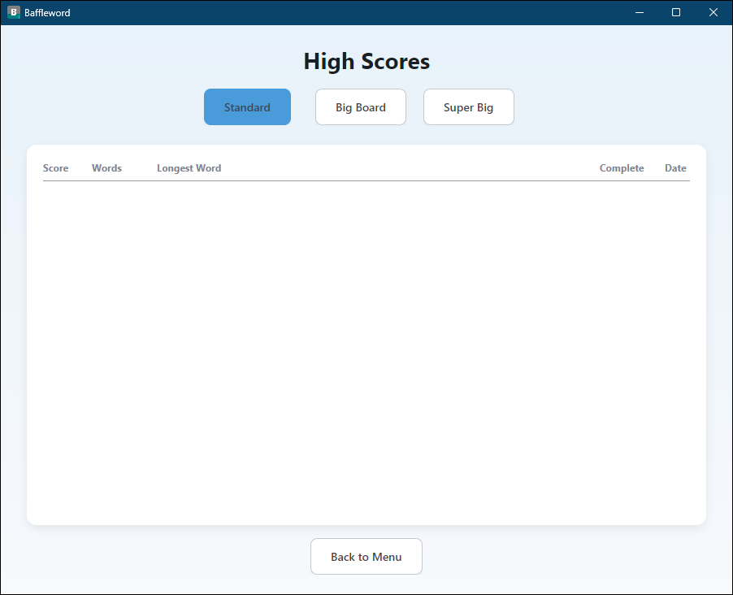 | 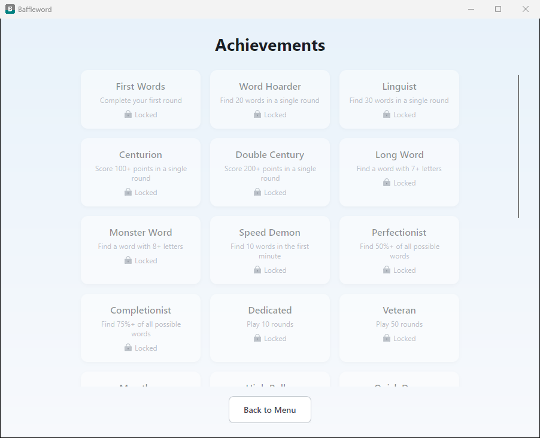 |

## Scoring

### Standard & Big Board

| Word Length | Points |
|-------------|--------|
| 3–4 letters | 1      |
| 5 letters   | 2      |
| 6 letters   | 3      |
| 7 letters   | 5      |
| 8+ letters  | 11     |

### Super Board

| Word Length | Points |
|-------------|--------|
| 4 letters   | 1      |
| 5 letters   | 2      |
| 6 letters   | 3      |
| 7 letters   | 5      |
| 8 letters   | 11     |
| 9+ letters  | 2 per letter |

## Prerequisites

- [.NET 10 SDK](https://dotnet.microsoft.com/download/dotnet/10.0) (10.0.200+)
- Linux, macOS, or Windows 10/11

## Build & Run

```bash
# Clone the repository
git clone https://github.com/RandyNorthrup/baffleword.git
cd baffleword

# Build
dotnet build

# Run
dotnet run --project src/Baffleword.App

# Create a self-contained Linux x64 build
dotnet publish src/Baffleword.App/Baffleword.App.csproj --configuration Release --runtime linux-x64 --self-contained true --output ./publish/linux-x64

# Create a self-contained Windows x64 build for installer packaging
dotnet publish src/Baffleword.App/Baffleword.App.csproj --configuration Release --runtime win-x64 --self-contained true --output ./publish/win-x64
```

Tagged releases build a signed Windows installer with Velopack plus self-contained Linux and macOS archives. Push a tag like `v1.5.7`; the release workflow uploads the generated artifacts for all platforms.

Required repository secrets for release signing:
- `WINDOWS_SIGNING_CERTIFICATE_BASE64` — base64-encoded `.pfx` certificate
- `WINDOWS_SIGNING_CERTIFICATE_PASSWORD` — certificate password

## Run Tests

```bash
dotnet test
```

Tests run across 4 test projects:
- **Baffleword.Core.Tests** — Game engine, board generation, scoring, dictionary, achievements, statistics
- **Baffleword.App.Tests** — ViewModels, navigation, paths, commands
- **Baffleword.Data.Tests** — SQLite repositories, settings persistence
- **Baffleword.Audio.Tests** — Audio manager interface tests

## Project Structure

```
src/
  Baffleword.Core/       Core game logic, models, services, dictionary
  Baffleword.App/        Avalonia application, views, view models, themes
  Baffleword.Data/       SQLite data layer, repositories
  Baffleword.Audio/      Cross-platform audio system
tests/
  Baffleword.Core.Tests/
  Baffleword.App.Tests/
  Baffleword.Data.Tests/
  Baffleword.Audio.Tests/
docs/
  assets/                README screenshots
```

## Architecture

- **MVVM** — ViewModelBase with INotifyPropertyChanged, RelayCommand, implicit DataTemplates
- **DI** — Microsoft.Extensions.DependencyInjection for all services and ViewModels
- **Navigation** — NavigationService resolves ViewModels from DI, ContentControl-based view switching
- **Data** — SQLite via Microsoft.Data.Sqlite for high scores, achievements, statistics, settings; user data and logs live under the platform local application-data folder
- **Dictionary** — Trie data structure loaded from embedded NWL2020 word list resource
- **Audio** — SoundFlow-backed ISoundEffectPlayer and IMusicPlayer implementations

## Tech Stack

- .NET 10 / C# 14
- Avalonia UI
- SQLite (Microsoft.Data.Sqlite)
- SoundFlow audio playback
- Velopack Windows installer packaging
- xUnit + Moq + FluentAssertions (testing)
- StyleCop + SonarAnalyzer + .NET Analyzers (code quality)

## Disclaimer

Baffleword is an independent, fan-made parody clone of the dice word game commonly known as Boggle®. It is **not affiliated with, endorsed by, sponsored by, or connected to Hasbro, Inc.** in any way. "Boggle" is a registered trademark of Hasbro, Inc.; any reference to it here is purely descriptive and nominative, used to identify the genre of game this project parodies. All Baffleword names, branding, code, dice configurations, and assets are original to this project. No Boggle artwork, logos, or proprietary materials are used. If you own intellectual property you believe is misused here, please open an issue.

## License

MIT

## Support this project

If this project saves you time, you can
[buy me a coffee](https://www.paypal.com/donate/?hosted_button_id=Q9VC7B42R7K82)
via PayPal. Thank you!
